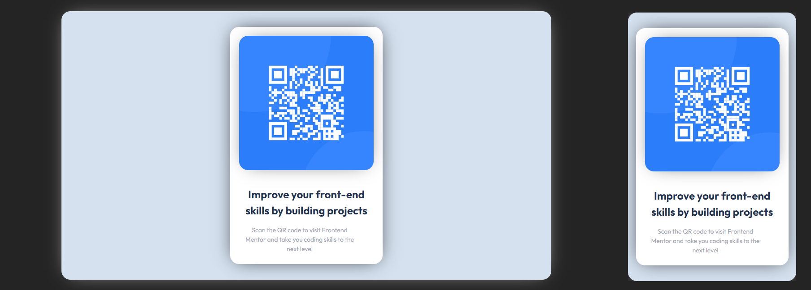

# Make It Real - QR CODE COMPONENT

This is a solution to the QR code component project of the Make It Real course.

## Table of contents

- [Overview](#overview)
  - [The challenge](#the-challenge)
  - [Screenshot](#screenshot)
- [My process](#my-process)
  - [Built with](#built-with)
  - [What I learned](#what-i-learned)
  - [Continued development](#continued-development)
- [Author](#author)


## Overview

### The challenge

Create a QR card in React.

### Screenshot




## My process

### Built with

- Semantic HTML5 markup
- CSS custom properties
- Flexbox
- Mobile-first workflow
- React.js

### What I learned


I learned how to create a component.
```jsx
const QRCard = () => {

  return (
    <>
      
      <div className="text-container">
        <h1>Improve your front-end skills by building projects</h1>
        <p>Scan the QR code to visit Frontend Mentor and take you coding skills to the next level</p>
      </div>
    </>
  )
}
```
 And how to import it.
```jsx
import './App.css'
import QRCard from './components/QRCard'

const App = () => {
  return (
    <>
        <div className='container'>
          <QRCard />
        </div>
    </>
  )
}
```

### Continued development


React.js is a very powerful tool. I look forward to learning more about props, states, hooks, and how to implement ES6 to make the most out of it.


## Author

- Daniel Hincapié Vargas
